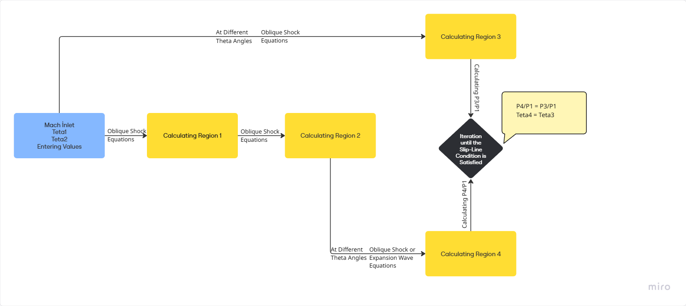

# Same-Family Shock Wave Interaction Analysis Tool

## 1. Project Objective

The main goal of this project is to **numerically analyze the intersection of same-family supersonic shock waves** and present the results to the user with numerical data, graphs, and animations.

The project is developed to understand the flow behavior resulting from shock wave intersections in supersonic flows, identify the intersection points, and analyze their effects on **pressure, temperature, and density**.

Instead of performing long CFD simulations, this interactive tool allows rapid calculation of oblique shocks and flow properties.

---

## 2. Assumptions
The numerical models developed in this study are based on the following assumptions:

- Constant specific heat ratio  
- Adiabatic flow  
- Negligible viscous effects  
- Compressible flow  
- Two-dimensional flow model  
- Ideal gas law  
- Sharp and perfect surfaces  
- Steady flow  
- No turbulence model used  

At the end of the study, the outputs were validated with SU2 CFD analysis under the same assumptions.

---

## 3. Methods Used

### Oblique Shock Analysis
`Oblique_Shock_Solver.py` calculates the flow property changes (pressure, temperature, etc.) after an oblique shock in supersonic flow.

### Prandtl-Meyer Expansion Wave Analysis
`Expansion_Wave_Solver.py` calculates the changes in flow properties after a Prandtl-Meyer expansion wave in supersonic flow.

### Same-Family Shock Intersections
`Same_Family_Shock_Solver.py` iteratively calculates the flow properties resulting from shock wave intersections.

Flowchart Visualization of Code Working Method

### Graphical Visualization
`Graphics.py` is used to plot pressure/deflection angle diagrams and intersection points.

### Animation
`Animation.py` uses **Turtle Graphics** to animate flow lines.

### User Interface
`Tkinter` is used to take input values from the user and display results **interactively**.

---

## 4. Installation and Requirements

- **Python 3.10** or higher  
- Required packages:  
   `pip install numpy scipy matplotlib pillow`

---

## 5. File Structure
- project/
- │
- ├── Same_Family_Shock_Solver.py   # Shock intersection calculations  
- ├── Oblique_Shock_Solver.py       # Oblique shock analysis  
- ├── Expansion_Wave_Solver.py      # Prandtl-Meyer expansion wave  
- ├── Graphics.py                   # Pressure vs Theta diagrams  
- ├── Animation.py                  # Flow animation  
- ├── GUI.py                        # Tkinter interface  
- ├── photo.png                     # Image representing regions in GUI  
- └── README.md                     # Project description  

---

## 6. Usage

### 6.1 Launching the Interface
Run `GUI.py` to open the **Tkinter-based interface**.

### 6.2 Input Parameters
- **Mach:** İnlet Mach number  
- **Theta1:** First ramp angle  
- **Theta2:** Second ramp incremental angle  

### 6.3 Calculation
Clicking the “Calculate” button:  
- Intersection points of shock waves are **numerically solved**  
- Flow properties (Mach, pressure, temperature, density ratios) are calculated for each region  
- Results are displayed in a table  
- Graphs (`grafik.png` and `grafik_zoomed.png`) are generated  

### 6.4 Graphs
- **Pressure-Deflection Angle Diagram:** Shows intersection points along with shock and expansion curves  
- **Zoomed Graph:** Highlights the intersection point  

### 6.5 Animation
Clicking the “Flow Animation” button shows the **flow lines and shock waves** based on calculated intersection points.  
The animation visually illustrates **shock directions, flow lines, and intersection points**.

---

## 7. Errors and Warnings

- **Iteration Error:**  
  If input values are too high or inappropriate, the iteration may not converge.  
  **Solution:** Increase `ITER_NUM`.

- **Detached Shock Warning:**  
  If the input theta exceeds the maximum theta, a detached shock occurs:  
  `"The theta angle you entered exceeds the maximum value, a detached shock occurs!"`

- **File Not Found:**  
  Missing graphics or default image files will cause an error.

- **Mach Number:**  
  If the Mach number is below 1, no shock forms, and the user is warned.

---

## 8. Project Contributions

- Numerical shock analysis and visualization  
- Pressure-deflection angle diagram plotting  
- Animation to visualize flow and shock behavior  
- User-friendly Tkinter interface  
- This study aims to investigate the flow properties after same-family shock wave intersections and better understand the mechanism behind this interaction.

---

## Contact Information
For missing features, bugs, or other issues, please contact:  
[GitHub](https://github.com/mvergili64)  
Email: mehmetvergli43@gmail.com
